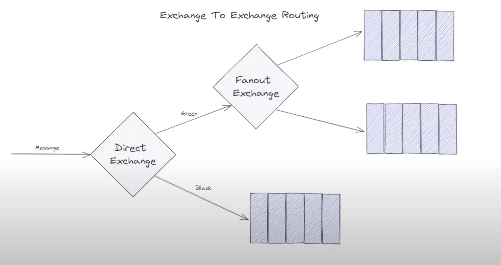
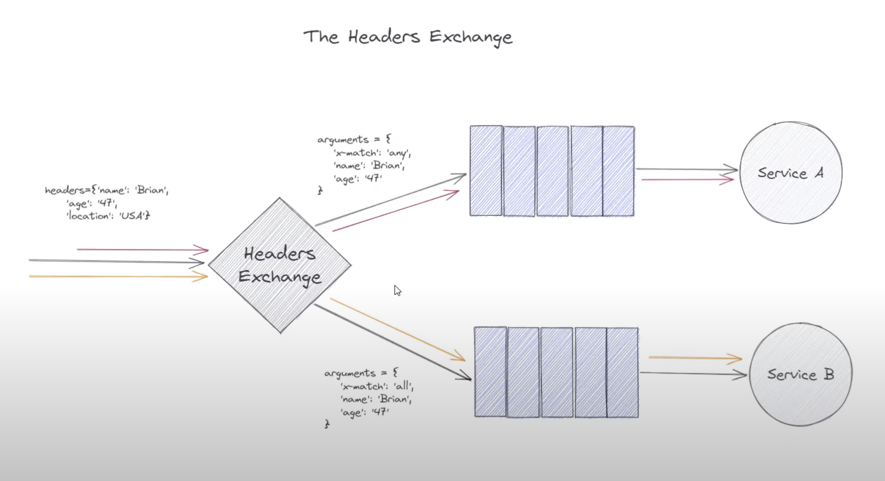
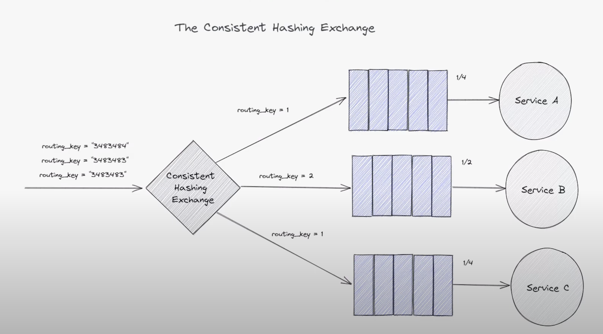

# rabbitMQ

This chapter covers `Exchange to Exchange Routing`, `Headers Exchange`, and `Consistent Hashing Exchange`.

## Exchange to Exchange Routing

The Exchange to Exchange Routing pattern in RabbitMQ is a way to route messages from one exchange to another exchange based on a routing key. This pattern is useful when you want to route messages from one exchange to another exchange based on a routing key.

## The Header Exchange

A headers exchange routes messages to queues based on the message's header attributes, not the routing key. This allows for more flexible and complex routing logic than other exchange types.

## How Header Exchange Works

Instead of a routing key, a headers exchange uses a set of key-value pairs in the message header for routing decisions. A queue is bound to the exchange with its own set of key-value pairs.

The routing logic depends on a special binding argument called x-match. This argument can have two values:

- `all` (default): The message is routed to the queue only if all of the headers in the queue's binding match the headers in the message. This is like a logical AND operation.

- `any`: The message is routed to the queue if at least one of the headers in the queue's binding matches a header in the message. This is like a logical OR operation.

## The Consistent Hashing Exchange

The `Consistent Hashing Exchange` is a specialized RabbitMQ exchange type that uses a consistent hashing algorithm to route messages. Its primary purpose is to distribute messages across a set of queues in a way that ensures all messages with the `same routing key` are delivered to the `same queue`. This is critical for maintaining `causal message order`.

## How it Works

- `Hashed Routing`: When a message arrives at a consistent hashing exchange, the exchange calculates a hash value from the message's `routing key`.

- `Hash Ring`: This hash value is used to determine a position on a "hash ring," a conceptual circle representing the range of all possible hash values.

- `Queue Selection`: Queues are also placed on this hash ring. The message is routed to the queue that is at or after its position on the ring.

- `Binding Weights`: When binding a queue to a consistent hashing exchange, you specify a numeric `binding key` that acts as a weight. A higher weight adds the queue to the hash ring more times, increasing its chance of receiving messages. This allows for simple, proportional load balancing.

## Diagrams

(Exchange to Exchange Routing Diagram)

(The Headers Exchange)

(The Consistent Hashing Exchange - routing_key=2 has more (double) hashing space than routing_key=1, so it will receive double messages)
