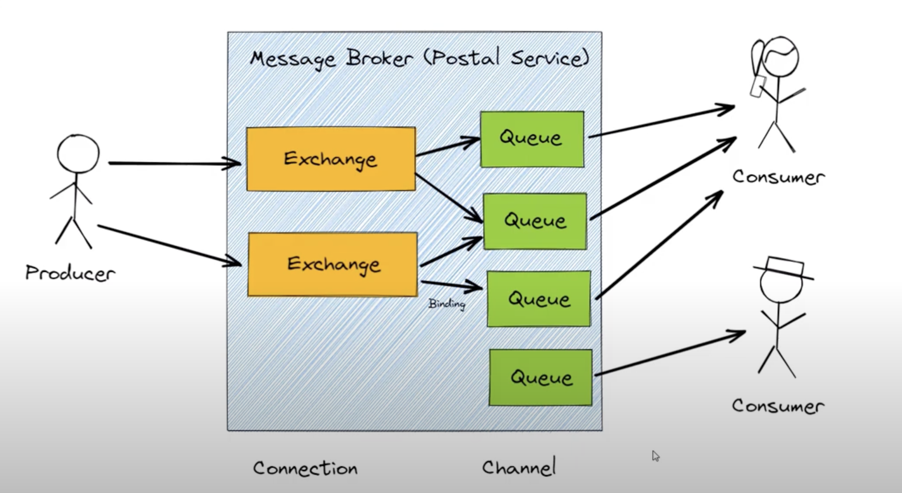

# RabbitMQ

## Core Concepts

RabbitMQ is a **message broker** that helps different services communicate in a reliable and decoupled way.  
It works by letting producers send messages, storing them temporarily in queues, and delivering them to consumers when they are ready.  
Here are its core building blocks:

### Producer

A **producer** is any application or service that creates and sends messages.  
Producers never send messages directly to a queue — they send them to an **exchange**, which decides where the messages should go.

Example:  
- A web app sending "new user signup" events.
- A background job publishing "resize this image" tasks.

---

### Consumer

A **consumer** is an application or service that receives messages from a queue and processes them.  
Consumers can be multiple, allowing RabbitMQ to **load-balance** work between them.

Example:  
- A worker that sends welcome emails.
- An analytics service that logs user activity.

---

### Exchange

An **exchange** is responsible for routing messages from producers to one or more queues.  
RabbitMQ supports several exchange types:
- **Direct** – routes by exact matching routing key.
- **Fanout** – broadcasts to all bound queues.
- **Topic** – routes by pattern (e.g., `logs.error`, `logs.*`).
- **Headers** – routes based on message headers.

Think of it as the "traffic controller" of messages.

---

### Queue

A **queue** stores messages until a consumer is ready to process them.  
Queues are **FIFO** (first in, first out) by default.  
They can be durable (persist messages even after broker restarts) or temporary.

---

### Binding

A **binding** is the rule that links an exchange to a queue.  
It tells RabbitMQ *which messages* should go into *which queues*.

Example:  
- Bind `logs.error` routing key to a queue that only receives error logs.

---

### Connection

A **connection** is a long-lived TCP connection between your application and RabbitMQ.  
It is relatively expensive to create, so most apps reuse a single connection.

---

### Channel

A **channel** is a lightweight virtual connection **inside** a single TCP connection.  
Channels let you open multiple streams of communication without creating multiple TCP connections, making them efficient.

Example:
- One app can publish and consume on separate channels over the same connection.

---

### Putting all these together:  

**Producers** send messages → **Exchange** routes them (via **Bindings**) → **Queues** hold them → **Consumers** receive and process them, all over a shared **Connection** with multiple **Channels**.