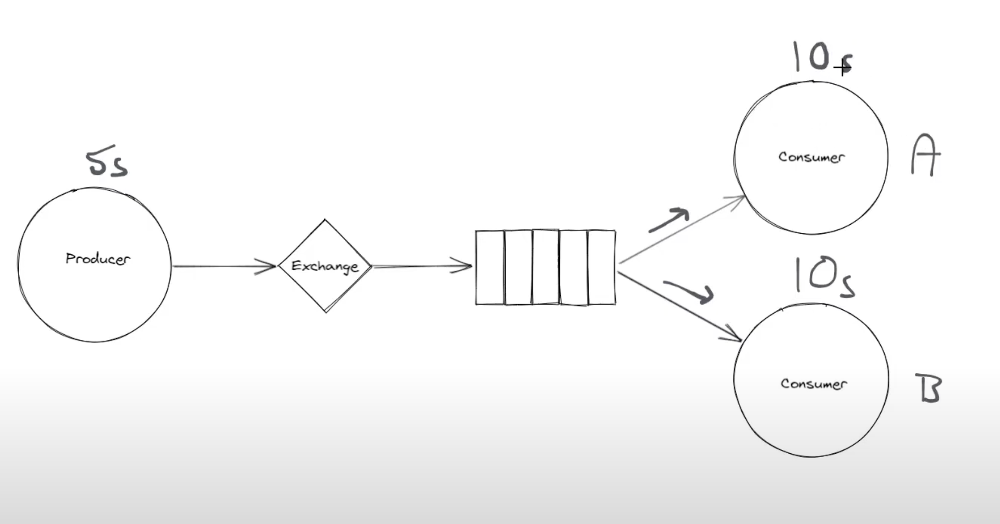

# RabbitMQ

## Competing Consumer Pattern

Competing Consumer Pattern is a messaging pattern where multiple consumers process messages from a queue. Each consumer processes messages independently, and the messages are distributed round-robin fashion.

## How It Works

In the competing consumer pattern:
- Multiple consumers connect to the same queue
- RabbitMQ distributes messages in round-robin fashion
- Each message is processed by only one consumer
- This enables load balancing and parallel processing

## Producer Example

```python
# producer_multiple.py
import pika
import sys

def send_multiple_messages():
    connection_parameters = pika.ConnectionParameters("localhost")
    connection = pika.BlockingConnection(connection_parameters)
    channel = connection.channel()
    
    # Declare the queue
    channel.queue_declare(queue="task_queue", durable=True)
    
    # Send multiple messages
    messages = [
        "Task 1: Process order #1001",
        "Task 2: Send email to user@example.com", 
        "Task 3: Generate report for Q3",
        "Task 4: Backup database",
        "Task 5: Update inventory",
        "Task 6: Process payment #2001",
        "Task 7: Send notification",
        "Task 8: Clean up temp files"
    ]
    
    for i, message in enumerate(messages, 1):
        channel.basic_publish(
            exchange="",
            routing_key="task_queue",
            body=message,
            properties=pika.BasicProperties(
                delivery_mode=2,  # Make message persistent
            )
        )
        print(f"[x] Sent message {i}: {message}")
    
    connection.close()

if __name__ == "__main__":
    send_multiple_messages()
```

## Consumer Example

```python
# consumer_worker.py
import pika
import time
import sys

def callback(ch, method, properties, body):
    message = body.decode()
    print(f"[x] Consumer {sys.argv[1] if len(sys.argv) > 1 else 'Unknown'} received: {message}")
    
    # Simulate work by sleeping
    time.sleep(2)
    
    print(f"[x] Consumer {sys.argv[1] if len(sys.argv) > 1 else 'Unknown'} finished processing")
    
    # Acknowledge the message
    ch.basic_ack(delivery_tag=method.delivery_tag)

def start_consumer():
    connection_parameters = pika.ConnectionParameters("localhost")
    connection = pika.BlockingConnection(connection_parameters)
    channel = connection.channel()
    
    # Declare the queue (in case producer hasn't run yet)
    channel.queue_declare(queue="task_queue", durable=True)
    
    # Set QoS to process one message at a time
    channel.basic_qos(prefetch_count=1)
    
    # Set up consumer
    channel.basic_consume(
        queue="task_queue",
        on_message_callback=callback,
        auto_ack=False  # Manual acknowledgment
    )
    
    consumer_id = sys.argv[1] if len(sys.argv) > 1 else "Unknown"
    print(f"[*] Consumer {consumer_id} waiting for messages. To exit press CTRL+C")
    
    try:
        channel.start_consuming()
    except KeyboardInterrupt:
        print(f"\n[!] Consumer {consumer_id} interrupted")
        channel.stop_consuming()
        connection.close()

if __name__ == "__main__":
    start_consumer()
```

## Running Multiple Consumers

```bash
# Terminal 1: Start first consumer
python3 consumer_worker.py Worker-1

# Terminal 2: Start second consumer  
python3 consumer_worker.py Worker-2

# Terminal 3: Start third consumer
python3 consumer_worker.py Worker-3

# Terminal 4: Send messages
python3 producer_multiple.py
```

## Key Features Demonstrated

### 1. Message Persistence
```python
# Make queue durable
channel.queue_declare(queue="task_queue", durable=True)

# Make messages persistent
properties=pika.BasicProperties(delivery_mode=2)
```

### 2. Fair Dispatch
```python
# Ensure each worker gets only one message at a time
channel.basic_qos(prefetch_count=1)
```

### 3. Message Acknowledgment
```python
# Manual acknowledgment ensures message isn't lost if worker crashes
channel.basic_consume(queue="task_queue", on_message_callback=callback, auto_ack=False)

# Acknowledge after processing
ch.basic_ack(delivery_tag=method.delivery_tag)
```

### 4. Key point

prefetch_count=1 + auto_ack=False ensures:

- Fair distribution based on processing speed

- True round-robin where each consumer gets work as they complete it

- Load balancing that adapts to each consumer's performance


## Competing Consumer Pattern Diagram


