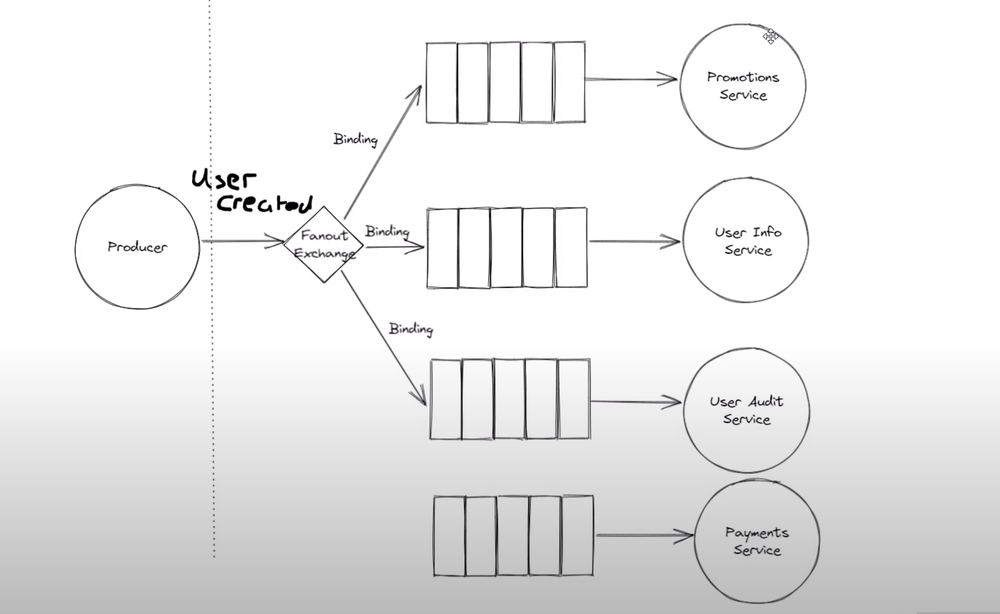

# RabbitMQ

## Pub-Sub Pattern

In the pub/sub pattern, multiple consumers subscribe to a topic, and messages are distributed to all subscribers based on the topic.

## How It Works

In the pub/sub pattern:
- Multiple consumers connect to the same queue
- RabbitMQ distributes messages in round-robin fashion
- Each message is processed by only one consumer
- This enables load balancing and parallel processing

## Pub/Sub Pattern Diagram

