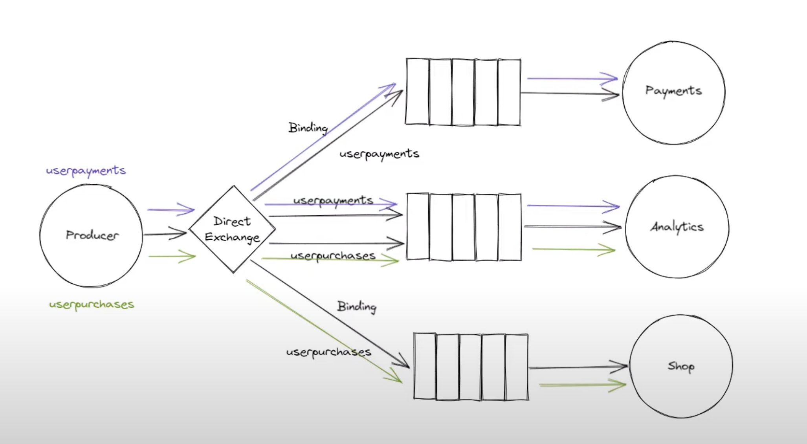
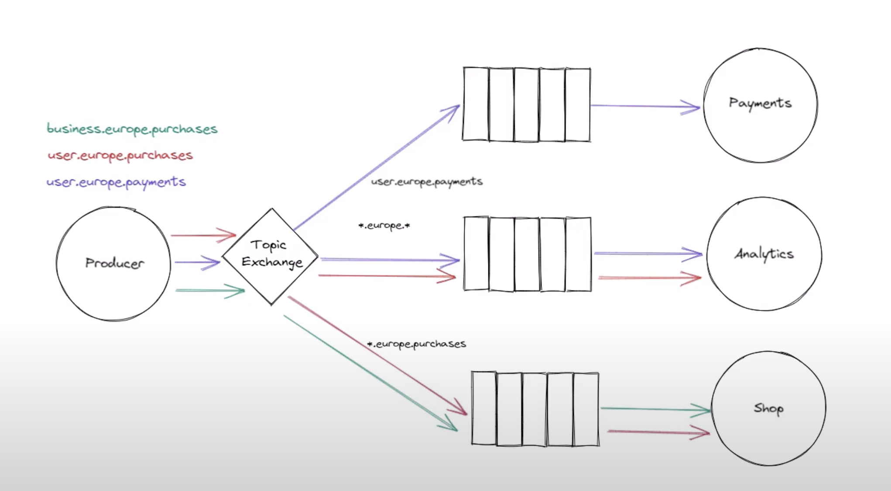
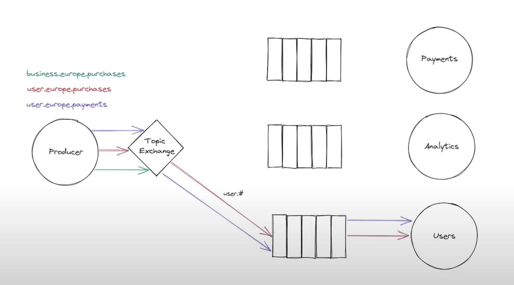

# rabbitMQ

## Routing

### Direct Exchange

A direct exchange routes messages to queues based on a perfect match between a message's `routing key` and a queue's `binding key`. Think of it like a strict postal service:

- A queue binds to the exchange with a specific, named binding key (e.g., "error").

- A producer sends a message to the exchange with a routing key (e.g., "error", "info").

- The direct exchange will only deliver the message to the queue(s) whose binding key is an exact match for the message's routing key.
Messages with no matching binding key are discarded. This is ideal for scenarios where you need to deliver messages to a specific, known destination, such as sending logs of different severities to different processing queues.

### Topic Exchange

A topic exchange is similar to a direct exchange but offers more flexible routing using `wildcards`. The routing keys must be a list of words separated by dots (e.g., logs.critical.server). When binding a queue, you can use two special wildcards in your binding key:

- `*` (star) matches `exactly one` word.

- `#` (hash) matches `zero or more` words.

This allows for more complex routing patterns. For example, a queue bound with `logs.critical.*` would receive messages with routing keys like `logs.critical.server` or `logs.critical.database`, but not `logs.critical`. A queue bound with `logs.#` would receive all messages starting with `logs.`, regardless of how many words follow. This is perfect for publish/subscribe systems where consumers are interested in a specific set of messages, like logs from a particular system or stock prices for certain regions.

## Routing Diagram

(Direct Exchange)

(Topic Exchange - Star)

(Topic Exchange - Hash)