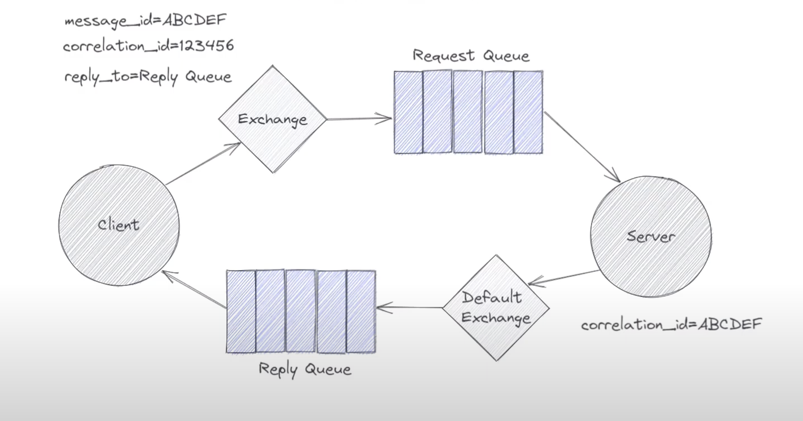

# rabbitMQ

## Request-Reply Pattern

The Request-Reply pattern in RabbitMQ is a way to mimic a traditional function call over a message queue, allowing a client to send a request and a server to send back a reply. This pattern enables asynchronous communication to behave synchronously from the client's perspective, without the client needing to wait for a response in a blocking manner. It's especially useful for scenarios where a client needs a specific response to a specific request.

## How It Works
The pattern involves a few key components and a specific flow:

- **Client (Requestor)**: The client creates a temporary, exclusive callback queue for receiving a response.

    1. It then sends a message to the server, including two special properties in the message header:

        - `reply_to`: The name of its unique callback queue.

        - `correlation_id`: A unique identifier for the request, which the client will use to match the response to the original request.

    2. The client then listens for a message on its callback queue.

- **Server (Replier)**: The server receives the request message from a designated queue.

    1. After processing the request, the server takes the `reply_to` and `correlation_id` from the received message.

    2. It sends the response message back to the client's `reply_to` queue, making sure to include the original `correlation_id` in the response's header.

- **Client (Response Handling)**: The client receives a message on its callback queue. It checks the `correlation_id` to ensure the response belongs to its original request. Once verified, it processes the response and can discard the temporary queue.

## Request-Reply Pattern Diagram

(Request-Reply Pattern Diagram)